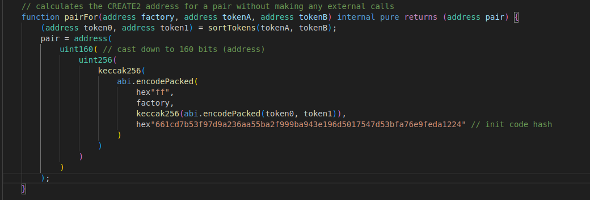

---

# 🦄 Uniswap V2 Foundry — Contracts, Deployment & Testing

A full end-to-end re-implementation of **Uniswap V2** using **Foundry** in **solidity 0.8.30**.
This project focuses to implement the uniswapv2 core and uniswapv2 periphery in a singlr repo — covering liquidity provision, removal, and all swap paths (single + multi-hop, token ↔ token ↔ ETH).

---

## 📁 Directory Overview

```
aayushmayush07-uniswapv2-foundry/
├── src/
│   ├── core/                 # Factory, Pair, ERC20 + Interfaces
│   └── router/               # Router01/02, WETH9, Libraries
├── script/
│   ├── core/                 # Core factory deploy script
│   └── router/               # Router deploy script (main focus)
├── test/
│   ├── core/                 # Core contract unit/integration tests
│   ├── router/               # Router integration + swap tests
│   ├── mocks/                # Mock ERC20 tokens
│   └── utils/                # Helper context + error contracts
├── lib/forge-std/            # Foundry standard library
└── foundry.toml              # Compiler + optimization settings
```

---

## ⚙️ Prerequisites

* [Foundry](https://book.getfoundry.sh/) installed

  ```bash
  curl -L https://foundry.paradigm.xyz | bash
  foundryup
  ```
* A local or testnet RPC (e.g. Anvil or Sepolia)
* Environment variable(s) for private keys

  ```bash
  export ANVIL_PRIVATE_KEY=0x...
  export SEPOLIA_PRIVATE_KEY=0x...
  # Sepolia
  SEPOLIA_RPC_URL=https://eth-sepolia.g.alchemy.com/v2/<your-key>
  SEPOLIA_PRIVATE_KEY=0x<your-burner-metamask-private-key>

  ```

 

  
---

## 🚀 Deployment via Router Script

Main deployment entrypoint:
**`script/router/DeployUniswapV2ViaRouter.s.sol`**

### Deploy to Local Anvil

```bash
anvil &
forge script script/router/DeployUniswapV2ViaRouter.s.sol:DeployUniswapV2ViaRouter \
  --rpc-url http://127.0.0.1:8545 \
  --broadcast \
  --private-key $ANVIL_PRIVATE_KEY \
  --via-ir
```

### Deploy to Sepolia

```bash
forge script script/router/DeployUniswapV2ViaRouter.s.sol:DeployUniswapV2ViaRouter \
  --rpc-url https://sepolia.infura.io/v3/<your-key> \
  --broadcast \
  --private-key $SEPOLIA_PRIVATE_KEY \
  --verify \
  --via-ir
```

**Script output:**

```
 Deploying to Local Anvil
WETH deployed at:  0x...
TokenA deployed at:  0x...
TokenB deployed at:  0x...
Router address:      0x...
```

---

## Init Code Hash

* Initial code pair hash is needed before using the code successfully in test or using cast. For that either use cast command to get the public INIT_CODE_HASH_VARIABLE (in UniswapV2Factory.sol) after deployment or 

  ```bash
  #run below command
  forge test test/router/routerIntegrationTest.t.sol  -vvv

  #you will get something like  below

  #Take below INIT_CODE_PAIR_HASH and put it in hex present in UniswapV2Library.sol removing 0x from beginning 0x661cd7b53f97d9a236aa55ba2f999ba943e196d5017547d53bfa76e9feda1224
  ```

 After getting the hash remove 0x from start of hex and put in UniswapV2Library.sol as shown in the image. 
 
 


## 🧪 Running Tests

### Run all tests

```bash
forge test -vvv
```

### Focus on router integration tests

```bash
forge test --match-path test/router/routerIntegrationTest.t.sol -vvv
```


## 🧠 Key Learnings

* **Router 02** builds on Router 01 by adding:

  * Support for **fee-on transfers**
  * **Permit-based** liquidity removal
  * Complete **ETH wrapping/unwrapping** logic
* `viaIR = true` is essential for compiling complex router logic in 0.8.30
* `UniswapV2Library.pairFor()` allows pre-computing deterministic pair addresses
* Mock tokens make it easy to test liquidity and swap flows end-to-end in Foundry

---

## 🔍 Foundry Config (`foundry.toml`)

```toml
[profile.default]
src = "src"
out = "out"
libs = ["lib"]


viaIR= true
optimizer=true
```

---

## 📚 References

* [Uniswap V2 core](https://github.com/Uniswap/v2-core)
* [Uniswap V2 periphery](https://github.com/Uniswap/v2-periphery)
* [Foundry Book](https://book.getfoundry.sh/)
* [ERC20](https://github.com/aayushmayush07/erc20contract)
---

**MIT License** — 2026 © Etherzeth
Built with 🦄 Foundry and Solidity 0.8.30.

---

